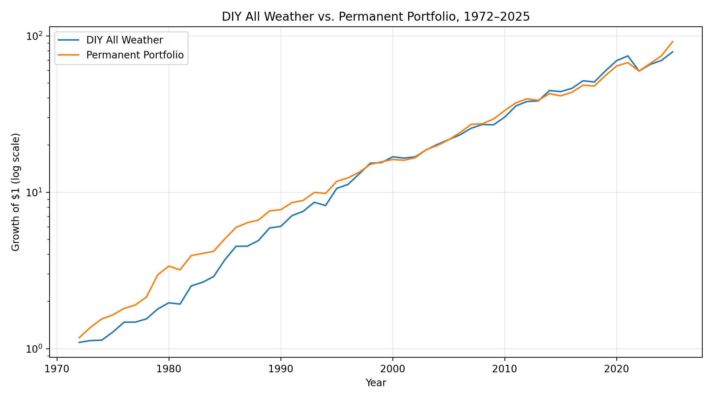

# Ray Dalio's All Weather Portfolio
April 14, 2026
##

Ray Dalio’s All Weather portfolio is often described as the more engineered, risk-balanced cousin of Harry Browne’s Permanent Portfolio. The common DIY approximation uses **30% stocks, 40% long Treasuries, 15% intermediate Treasuries, 7.5% gold, and 7.5% commodities**. Like the Permanent Portfolio, the idea is not to forecast the next macro regime, but to own a mix of assets that can hold up across very different environments.

Using the same 1972–2025 backtest framework as the Permanent Portfolio update, this DIY All Weather mix produced an **average annual return of 8.80%**, a **CAGR of 8.43%**, and a **cumulative return of 7799.2%**. In dollar terms, **$1 grew to about $78.99**. The **worst calendar year** in this series was **2022 (-20.02%)**, and the **worst daily drawdown** was about **-29.41%**.

Compared with the Permanent Portfolio, the DIY All Weather portfolio earned **slightly lower long-run returns** in this backtest and experienced **deeper drawdowns**. The Permanent Portfolio compounded at **8.73%**, grew **$1 to about $91.84**, and saw a worst daily drawdown of about **-16.35%**. In that sense, All Weather looks like a more bond-heavy and more institutional version of the same basic idea: diversify across economic regimes rather than depend on one forecast being right.

## Key References

- **Bridgewater Associates, [The All Weather Story](https://www.bridgewater.com/research-and-insights/the-all-weather-story)**
  - Primary source on the origin and philosophy of the All Weather strategy.

- **State Street / Bridgewater, [Diversify for all seasons with the All Weather ETF ALLW](https://www.ssga.com/us/en/intermediary/capabilities/alternatives/all-weather-etf)**
  - Plain-English overview of the All Weather approach and its economic-regime framework.

- **Portfolio Charts, [Permanent Portfolio](https://portfoliocharts.com/portfolios/permanent-portfolio/)**
  - Clear summary of Harry Browne’s Permanent Portfolio and its classic 25/25/25/25 structure.

- **Investopedia, [What Is a Permanent Portfolio?](https://www.investopedia.com/terms/p/permanent-portfolio.asp)**
  - Concise general reference for the Permanent Portfolio concept.

- **Optimized Portfolio, [Ray Dalio All Weather Portfolio Review, ETFs, & Leverage (2026)](https://www.optimizedportfolio.com/all-weather-portfolio/)**
  - Useful reference for the common DIY All Weather approximation used by individual investors.
