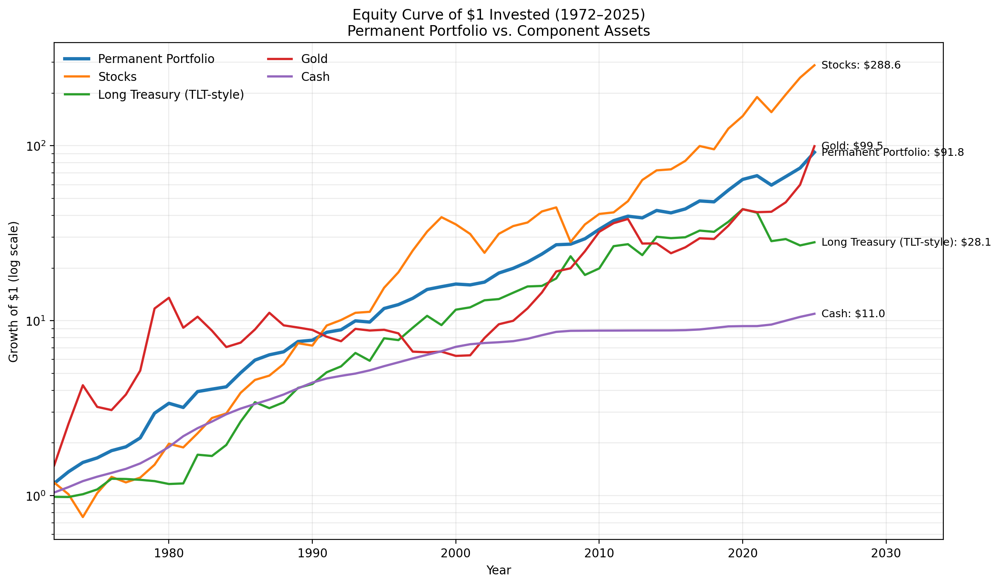

# Permanent Portfolio, Revisited (1972–2025)

April 14, 2026

#

Back in 2017, I wrote about the [Permanent Portfolio](https://biaohao.blogspot.com/2017/02/#493024439047265142) as one of the simplest and most elegant portfolio ideas I had come across: 25% stocks, 25% long-term Treasuries, 25% gold, and 25% cash. What I liked most was not that it promised the highest return. It was that it did not require me to make a grand macro forecast and market timing. I started experimenting with it using the custodian's accounts for my children. Another advantage is that I do not need to spend time on these small accounts, other than the annual rebalance. The more rewarding part is not in the return of those initial accounts, but in the understanding of different asset classes and their roles in portfolios. I had added Gold to my other accounts since then, which had a spectacular return in the Gold bull market in the last few years.

Nearly a decade later, and with a much longer record now in hand, I think the idea is worth revisiting.

## Why I Still Find the Permanent Portfolio Interesting

The genius of the Permanent Portfolio is not complexity. It is balance. Each asset is there for a different economic regime:

- **Stocks** for prosperity and growth
- **Long Treasuries** for recession, deflation, and falling rates
- **Gold** for inflation, monetary disorder, and loss of confidence
- **Cash** for stability, optionality, and psychological comfort

No single sleeve always looks attractive. That is exactly the point. The portfolio is built on the assumption that we do not know what comes next.

## What the Updated Record Says

Using annual returns from 1972 through 2025, with a revised long-bond sleeve modeled as a **TLT-style 20+ Treasury proxy** and drawdowns calculated from a **daily** portfolio path, the Permanent Portfolio delivered an **average annual return of 9.04%** and a **CAGR of 8.73%**. Over the full period, that works out to a **cumulative return of about 9,084%**, which means **$1 grew to about $91.84**. The numbers might be slightly different from other sources due to slight data differences.

That is not the kind of number that will make aggressive investors abandon an all-equity strategy. But for a portfolio designed around resilience rather than optimization, it is remarkably strong.

## How the Pieces Performed

The individual sleeves tell the story well:

- **Stocks:** 12.48% average annual return, 11.06% CAGR, 28,755% cumulative return, **$1 grew to about $288.55**
- **Long Treasuries (TLT-style proxy):** 7.37% average annual return, 6.37% CAGR, 2,708% cumulative return, **$1 grew to about $28.08**
- **Gold:** 11.70% average annual return, 8.89% CAGR, 9,849% cumulative return, **$1 grew to about $99.49**
- **Cash:** 4.59% average annual return, 4.53% CAGR, 995% cumulative return, **$1 grew to about $10.95**
- **Permanent Portfolio:** 9.04% average annual return, 8.73% CAGR, 9,084% cumulative return, **$1 grew to about $91.84**

That mix is what makes the portfolio durable. Stocks generated the strongest long-run growth. Gold contributed far more than many investors would expect, thanks to the bull market in recent years. Long Treasuries provided powerful diversification over many decades, even without matching stock returns. Cash, while boring, was never useless: it reduced volatility, provided liquidity, and made rebalancing easier when markets were stressed.

*Equity curve of $1 invested in each asset class and in the Permanent Portfolio, 1972–2025. The chart uses a log scale so the relative compounding paths remain visible.*

## The Stress Test That Mattered

The years after my original 2017 post gave the Permanent Portfolio a more meaningful test than many of its supporters had previously experienced. In 2022, both stocks and long-duration bonds fell sharply at the same time. That was a genuine challenge for a portfolio that relies on diversification across economic regimes.

In this updated series, **2022 was the worst calendar year** for the portfolio at **-11.67%**. The **worst daily drawdown** over the full sample was about **-16.35%**. Neither number is pleasant, but both are still manageable relative to the drawdowns that stock-heavy portfolios (such as the classic 60/40 portfolio) can suffer.

Just as important, the portfolio recovered. In **2025**, the Permanent Portfolio gained **23.09%**, making it one of the strongest years in the entire sample, driven largely by gold. The **best calendar year** remains **1979**, when the portfolio returned **38.52%**, also driven largely by gold.

## What Changed in My Thinking

My conclusion is not dramatically different from what it was in 2017, but it is a little more nuanced now.

I appreciate the Permanent Portfolio more as a *behavioral* solution than as a purely mathematical one. A portfolio is only as good as your ability to stick with it. In that sense, the Permanent Portfolio remains brilliant. It acknowledges uncertainty, gives every major macro regime a seat at the table, and reduces the odds that one wrong view ruins the plan.

At the same time, the opportunity cost is real. If you are young, still accumulating, have a long horizon, and can tolerate severe drawdowns, a more growth-oriented allocation will likely compound faster. Holding 25% in cash and 25% in gold is a meaningful drag during long equity-led bull markets. 

So the Permanent Portfolio is not the best answer to every investing question. But it is still one of the best answers to this specific question: *What should I own if I do not want my success to depend on being right about the next macro regime?*

## What I Would Do Today

If I were starting from scratch today, I would still take the Permanent Portfolio very seriously. I do not see it as the perfect answer for every investor or every stage of life, but I still think it is one of the most thoughtful portfolio designs out there. It is built on a simple idea that is easy to forget: the future is hard to predict, and a good portfolio should respect that.

For my own portfolio, things are a little different now. In recent years, I have relied more on market timing to work with the cycles of different asset classes, and that has produced decent risk-adjusted returns for me. Even so, I still keep the Permanent Portfolio in the back of my mind.
I think of it as a benchmark, or maybe more accurately, an anchor. It gives me a reference point for what a balanced and resilient portfolio can look like without requiring constant forecasting. Even when I make more active decisions, I often find myself comparing them against that framework and asking whether I am truly improving the portfolio or just making it more complicated.

That is why I have never really moved on from the idea. I may not run my whole portfolio this way, but I can easily see myself coming back to it with a portion of my assets, especially the part where simplicity, durability, and peace of mind matter most.

In that sense, the Permanent Portfolio still plays an important role for me. Not necessarily as the whole plan, but as a standard I continue to measure against.

**Data note:** This update uses a TLT-style 20+ Treasury proxy for the long-bond sleeve rather than a pure 30-year constant-maturity Treasury series, and drawdowns are calculated from a daily portfolio path rather than from year-end returns.
